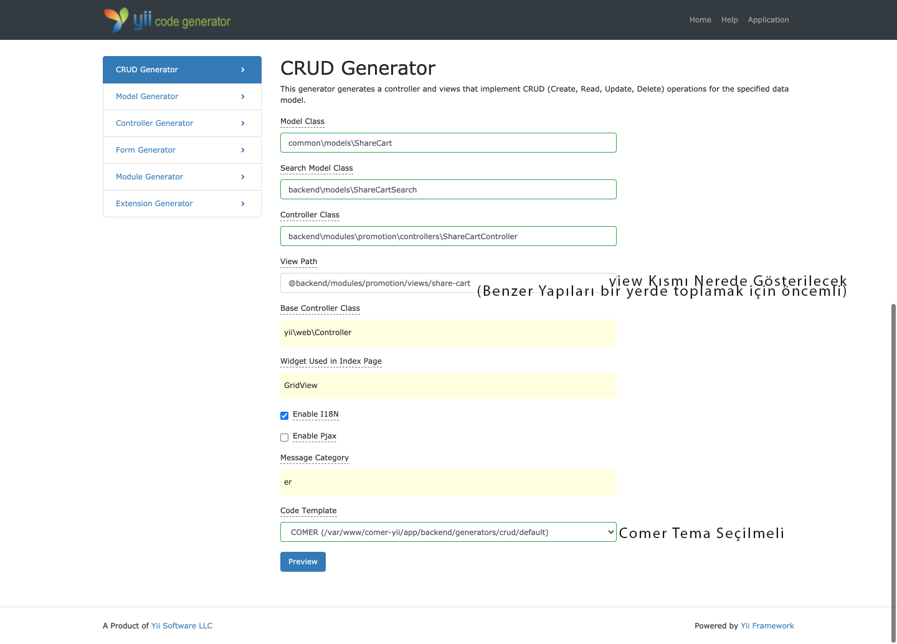

# CRUD

## Backend Crud Generator



Eğer oluşturmuş olduğunuz yapıya otomatik parametre tanımlamak isterseniz şunu uygulayabilirsiniz
>Örneğin Create Standart Yapısı Şu Şekildedir

```php
...
    public function actionCreate()
    {
        $model = new ShareCart();
...
```

```php
    public function actionCreate()
    {
        $model = new ShareCart([
            'user_id' => Yii::$app->user->id,
            'by_user_id' => Yii::$app->user->id,
            //Buraya istediğiniz verileri manuel olarak girebilirsiniz
        ]);
```

