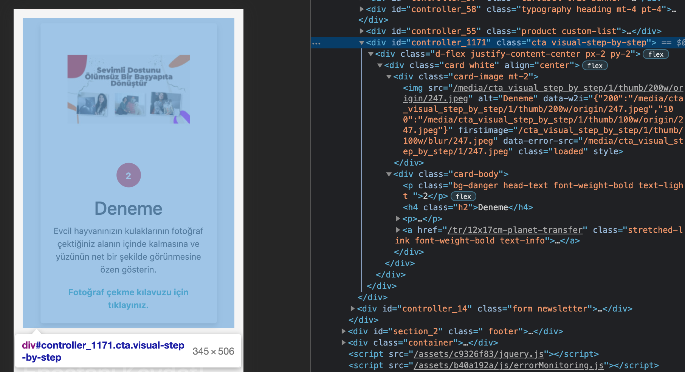

Bu bölüm web site tarafıyla alakalıdır.

## Frontend Tarafındaki Parçacığın Comer'de Neye Denk Geldiğini Nerden Bulabilirim

>İlgili Component'e sağ klik incele yapıp buradan ilgili komponentin en dışını seçip controller id li yerin classından ulaşabilirsiniz

Aşağıdaki örnekte componentin cta visual-step-by-step olduğunu görüyoruz

