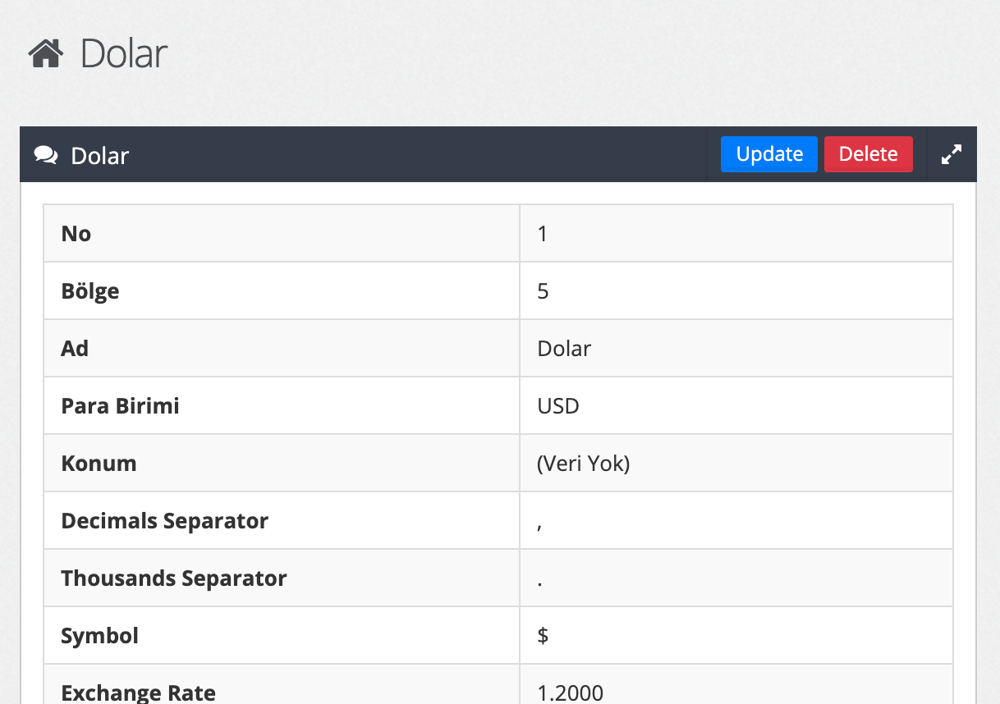

# Backend

> bakcend


[Başlangıç](/getStarted)

    vagrant up && vagrant ssh

# GridView 

GridView;  Sıralama, sayfalama ve ayrıca verileri filtreleme gibi özellikler sağlar. Temel kullanım şuna benzer:

> İmport
 ```php
    use backend\components\widgets\GridView;
 ```  

 ```php
    <?= GridView::widget([
        'dataProvider' => $dataProvider,
        'filterModel' => $searchModel,
        'columns' => [
            ['class' => 'yii\grid\SerialColumn'],
            'id',
            'title',
            'updated_at',
            'created_at',

            ['class' => 'yii\grid\ActionColumn'],
        ],
    ]); ?>
 ```  
Temel görünümü şuna benzer:


## Responsive GridView

GridView'de ki Columnlara genişletilebilir (Collapsible) özelliği verebilmek için kullanım şu şekildedir:

 ```php
            [
                'attribute' => 'id', //attribute adı yazılır
                'headerOptions' => ['data-class' => 'expand'], //expand classı verilir
            ],
 ```  
Hangi Columnların gizleneceğini ayarlama ise şu şekildedir:
 ```php
            [
                'attribute' => 'is_active', //attribute adı yazılır
                'headerOptions' => ['data-hide' => 'phone,tablet'], // Gizlemek istediğiniz cihazları belirtiniz
            ],
 ```  
Sonuc şu şekildedir:


# GridWrap 

Panel üstünde sayfalardaki ayrımları kolay yapabilmeyi amaçlar. View içinde kullanılır. İç içe kullanıma uygundur.
GridWrap sayesinde aşağıdaki gibi bir görüntü elde edebilirsiniz. GridWrap default olarak her sayfada çalışır.


 
> İmport
 ```php
    use backend\components\widgets\GridWrap;
 ```

> Örnek Kullanımlar   
 ```php
GridWrap::begin([
    'title' => \Yii::t('er', 'Bu İşlem ile Teslimi Yapılması Gereken Ürünler'),
    'size' => GridWrap::SIZE_XS12_SM12_MD6_LG6,
    'color' => 'red',
    'noPadding' => true
]);
echo Html::tag('div', 'content');
GridWrap::end();
 ```   

## setToolbar (panel düzeltmeleri)    

Default gelen action toollara daha iyi bir görüntü vermek adına eski actionTool silinir yerine aşağıdaki kullanım eklenir
>Update Sayfası Örneği
 ```php
GridWrap::setToolbar([
    Html::a('Update', ['update', 'id' => $model->id], ['class' => 'btn btn-primary btn-xs']),
    Html::a('Delete', ['delete', 'id' => $model->id], [
        'class' => 'btn btn-danger btn-xs',
        'data' => [
            'confirm' => Yii::t("er", 'Are you sure you want to delete this item?'),
            'method' => 'post',
        ],
    ])
]);
 ```
Ortaya çıkan görüntü bu şekildedir.


>View Sayfası Örneği
 ```
GridWrap::setToolbar([
    Html::a(Yii::t('er', 'Create Affiliate'), ['create'], ['class' => 'btn btn-success'])
]);
 ```


## setNoPadding (panel düzeltmeleri)

Filtreleme oluşturmadan önce 

```php
   use backend\components\widgets\GridWrap;
   use backend\components\widgets\GridView;
```
```php
GridWrap::setNoPadding();
```
```php
GridWrap::setToolbar([
    Html::a(Yii::t('er', 'Create Place Province'), ['create'], ['class' => 'btn btn-success'])
]);
```


 yapılarını eklememiz gerekmektedir.  Sonrasında çalışılan dosyanın searchModeline gidilir ve kod yapısında belirtilmiş kısma  
 ```php
 use Search;
```
 eklenir.  
 
```php
class PlaceProvinceSearch extends PlaceProvince
 {
     use Search;
     /**
      * {@inheritdoc}
      */
     public function rules()
     {
         return [
             [['id'], 'integer'],
             [['country_code', 'name'], 'safe'],
         ];
     }
```
*use Search; ın ekleneceği alan*


  
Bu işlemler tamamlandıktan sonra böyle bir görüntü elde edilir.

# Filtreleme (Filter)


Eğer filtreleme oluşturulmak isteniyorsa,
Daha önce use Search; oluşturduğumuz alanın altına bunları ekliyoruz ve use Search; kısmını siliyoruz daha sonra `    public $optionFields = [];
` içinde düzenlemeler yapacağız.
  ```php
    public $filters = [];
    public $filterNumberCondition = [];
    public $optionFields = [];
```
```php
            [['filterNumberCondition', 'filters'], 'safe'],
```
Yukarıdaki kodu da `public function rules()`'un içine ekliyoruz.  

Sırada neleri aratacağımız var.  
ID aratma örneği
```php
    public $optionFields = [
    'id' => Flexible::OPTION_FIELD__NUMBER,
];
```   
aynı dosya içindeki
`        $this->load($params);
`  kodundan sonra 
 ```php
        BackendFilterCache::create($this, $query);
```
kodunu ekleyiniz ve eğer integer bir değer filtreliyorsanız searchModeldeki `            'id' => $this->id,
` kısmını silin.
```php
  $query->andFilterWhere([
            'id' => $this->id,
        ]);
```

Son olarak controller yapısına gidip $dataProvider'e post methodu ekleyiniz.


>Not: Filtre hazırlarken olmaması gereken bir hata ile karşılaşıyorsanız 
```sql
TRUNCATE `evimdehobi-db`.`backend_filter_cache`
```  
SQL sorgusunu çalıştırın.


## Filtreleme De Option Fields'lerin Kullanımı

Option Fields'lerin örnek kullanımı şu şekildedir:
```php
 public $optionFields = [
id'=>Flexible::
        'id' => Flexible::OPTION_FIELD__NUMBER,
        'message' => Flexible::OPTION_FIELD__TEXT_INPUT,
        'type' => Flexible::OPTION_FIELD__SELECT2,
    ];
```
Option Fieldsler için belirlenmiş tüm const değerlerini Flexible class'ı ile çağırabilirsiniz ve hazır const değerleri şunlardır:

```php
    const OPTION_FIELD__TEXT_INPUT = 'text';
    const OPTION_FIELD__CHECKBOX = 'checkbox';
    const OPTION_FIELD__DROP_DOWN_LIST = 'dropDownList';
    const OPTION_FIELD__ICON_PICKER = 'iconPicker';
    const OPTION_FIELD__VECTOR_ICON_PICKER = 'vectorIconPicker';
    const OPTION_FIELD__HTML_EDITOR = 'htmlEditor';
    const OPTION_FIELD__URL = 'url';
    const OPTION_FIELD__BLOGS = 'blogs';
    const OPTION_FIELD__USERS = 'users';
    const OPTION_FIELD__MULTI_SELECT2 = 'multiSelect2';
    const OPTION_FIELD__BLOCK_CONTENT = 'blockcontent';
    const OPTION_FIELD__COLOR = 'color';
    const OPTION_FIELD__ICON = 'icon';
    const OPTION_FIELD__IMAGE = 'image';
    const OPTION_FIELD__NUMBER = 'number';
    const OPTION_FIELD__PASSWORD_INPUT = 'passwordInput';
    const OPTION_FIELD__PLACE = 'place';
    const OPTION_FIELD__PRODUCTS = 'products';
    const OPTION_FIELD__PRODUCT_TAGS = 'productTags';
    const OPTION_FIELD__SELECT2 = 'select2';
    const OPTION_FIELD__TEXT_AREA = 'textarea';
    const OPTION_FIELD__TITLE = 'title';
    const OPTION_FIELD__DATE_TIME = 'datetime';
    const OPTION_FIELD__BRAND = 'brand';
```

>Not: Bazı input türleri ek kodlamalar talep edebilir.

Eğer OPTION_FIELD__DROP_DOWN_LIST kullanılacaksa Child Model'in içene bu property adıyla
bir list fonksiyonu tanımlanmalı yani şu şekilde. 
```php
          public function list_propertyName()
          {
               return [
                   'value' => 'text'
               ];
          }
```
Bunu yapmazsanız zaten debug olarak sizi uyaracaktır. Yapmanızı zorunlu kılacaktır.

## GridView'de Buton Kullanımı

>Basit Kullanımı Şu Şekildedir:

```php
            [
        "attribute" => 'status',
//        'headerOptions' => ['data-hide' => 'phone,tablet'],
        "value" => function ($model) {
            if ($model->status == StockAlarm::STATUS_SUCCESS  ) {
                $return[] = Html::tag('p', Yii::t('er', 'Bilgilendirildi'), ['class' => 'btn-xs btn btn-success']);
            }
            else{
                $return[] = Html::tag('p', Yii::t('er', 'Bekleniyor'), ['class' => 'btn-xs btn btn-danger']);
            }
            return implode(" ", $return);
        },
        "format" => "raw"
    ],
```
