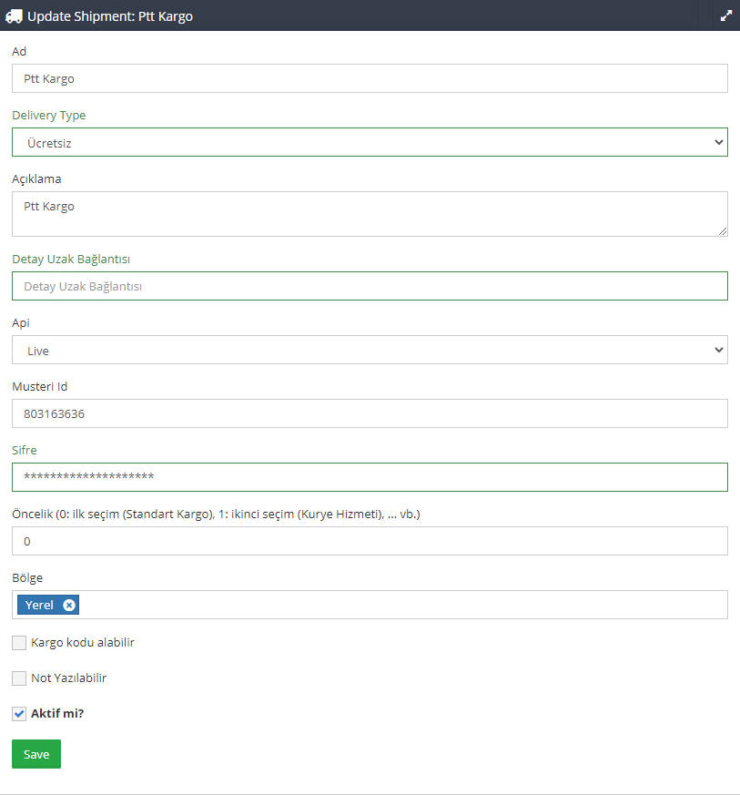

# Shipment

## Model Yapısı
Shipment lojistik bilgisi içeren işlem veya API'lerde kullanılan modeldir. Bu model temel olarak tanımlanmış bazı değişkenler
içerir. Bu değişkenler;

* DELIVERY_TYPE_FREE
* DELIVERY_TYPE_BUYER_PAYS
* DELIVERY_TYPE_MERCHANT_PAYS
* $optionFieldsForAdmin

### Değişkenler
#### DELIVERY_TYPE_FREE
```php
const DELIVERY_TYPE_FREE = 'free';
```
Ücretsiz gönderim yapılan işlemlerde kullanılacak constant değişken.
#### DELIVERY_TYPE_BUYER_PAYS
```php
const DELIVERY_TYPE_BUYER_PAYS = 'buyerPays';
```
Alıcı ödemeli gönderim yapılan işlemlerde kullanılacak constant değişken.
#### DELIVERY_TYPE_MERCHANT_PAYS
```php
const DELIVERY_TYPE_MERCHANT_PAYS = 'merchantPays';
```
Gönderici ödemeli gönderim yapılan işlemlerde kullanılacak constant değişken.
#### optionFieldsForAdmin
```php
 $optionFieldsForAdmin = [];
```
Bu array dizisinde yöneticinin model içerisinde kullanacağı ayar parametreleri tutulur. Bu bilgiler API işlemleri sırasında
sağlayıcıya bağlanma, oturum açma, doğrulama veya veri gönderme esnasında istenilen bilgileri içerir.

Örneğin PTT Kargo ile ilgili API işlemlerinde, sağlayıcı "Müşteri ID ve Şifre" parametreleri istemektedir. Bu yüzden gerekli 
parametreler model içerisine tanımlanmalıdır.

 


