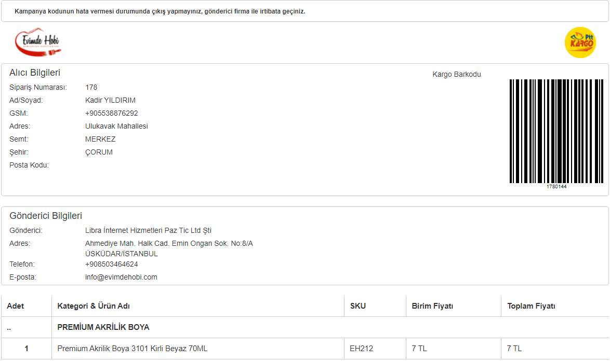

# Shipment
Shipment lojistik içeren işlem veya API'lerde kullanılacak modeller için base modeldir. 
Oluşturulacak modeller "Shipment" sınıfından türetilir. 
Shipment modeli ise "shipment" tablosunun modelidir ve Flexible sınıfından türetilmiştir.


## Shipment Modeli ve Yapısı
Model içerisinde ön tanımlı fonksiyonlar ve değişkenler bulunmaktadır. 
Ancak oluşturulacak yeni model içerisinde de "Shipment" modeline bağlı kalarak yeni fonksiyonlar eklenebilir.

**Shipment modelleri içerisinde işlemlerin çoğunluğu "CartShipment" modeli üzerinden yürütülmektedir. 
Bu yüzden lütfen ["CartShipment"](shipment?id=cart-shipment-modeli-ve-yapısı) modelinide inceleyiniz**

### Değişkenler
````php
// Gönderi türleri için tanımlanmış constant değişkenler.
const DELIVERY_TYPE_FREE = 'free'; // Ücretsiz Gönderim
const DELIVERY_TYPE_BUYER_PAYS = 'buyerPays'; // Alıcı Ödemeli Gönderim
const DELIVERY_TYPE_MERCHANT_PAYS = 'merchantPays'; // Gönderici Ödemeli Gönderim

// Model dosya adı
const FOLDER_NAME = "Shipment";

// Bu array dizisinde, kullanıcının model içerisinde kullanacağı yönetici ayar parametreleri tutulur.
// Ayrıca bu dizi "shipment" tablosunun "options" sütununa "json" formatında eklenir.
public $optionFieldsForAdmin = []; // Detaylı bilgiye örnek "Shipment Model ve API oluşturma" sayfasından ulaşabilirsiniz.

// Bu array dizisinde, kullanıcının model içerisinde kullanacağı "Alıcı Bilgileri" parametreleri tutulur.
// Kullanılacak "Alıcı Bilgileri" "UserDeliveryProfile" sınıfından alınır.
public $autoWriteFields = []; // Detaylı bilgiye örnek "Shipment Model ve API oluşturma" sayfasından ulaşabilirsiniz.

// autoWriteFields() fonksiyonu çalıştıktan sonra afterAutoWriteFields() çalışmasını sağlamak için kullanılır.
// $afterAutoWriteEnable değişkeninin değerine göre autoWriteFields() fonksiyonu içerisinde afterAutoWriteFields() fonksiyonu çağırılmalıdır.
public $afterAutoWriteEnable = true;
````

### Fonksiyonlar

>public function autoWriteFields($params = [])

autoWriteFields() fonksiyonu ile $autoWriteFields[] dizininde bulunan değerler inputa dönüştürülür. 
Böylece ihtiyaç duyulan verilerin kullanıcıdan giriş yapması istenir. 
Fonksiyon parametre olarak dizi alır.

````php
public function autoWriteFields($params = [])
    {
        $autoWriteFields = new AutoWriteFields([
            'fields' => $this->autoWriteFields,
            'object' => $this,
            'params' => $params
        ]);
        $autoWriteFields->loadValues();

        if ($this->afterAutoWriteEnable) {
            $this->afterAutoWriteFields();
        }
    }
````

>public function afterAutoWriteFields()

autoWriteFields fonksiyonundan sonra çalıştırılacak fonksiyondur. 
Fonksiyonunu çalışıp çalışmayacağı $afterAutoWriteEnable değerine göre belirlenmektedir. 
**Eğer afterAutoWriteFields() fonksiyonu kullanılmak isteniyorsa autoWriteFields() fonksiyonunda çağırılmalıdır.**

````php
public function afterAutoWriteFields()
    {
        // AutoWriteFields fonksiyonundan sonra çalıştırılmak istenen kodlar buraya yazılır.
    }
````

>public static function tableName()

tableName() fonksiyonu modelin bağlı olduğu tablo adını tutmaktadır. Static olarak tanımlıdır.

````php
public static function tableName()
    {
        return 'shipment';
    }
````

>public function rules()

rules() fonksiyonu ile model içerisinde kullanılan sütunlar ve bu sütunlara ait tip tanımlamaları yapılmaktadır. 
Bu tanımlamalar temel tanımlamalardır. 
Oluşturulacak yeni bir modelde, o modele ait farklı tanımlamalar yapılabilmektedir.
**rules() fonksiyonu içerisine tanımlanmayan değişkenler güvensiz veri olarak algınanır ve "null" değeri döner.** 

````php
public function rules()
    {
        return [
            [['name', 'description', 'allow_shipment_code', 'allow_note', 'delivery_type', 'position'], 'required', 'on' => 'forAdmin'],
            [['filter_categories', 'ignore_categories', 'filter_payment_methods', 'ignore_payment_methods', 'site_zone_id', 'options', 'created_at', 'updated_at'], 'safe'],
            [['allow_shipment_code', 'allow_note', 'is_deleted', 'position'], 'integer'],
            [['name'], 'string', 'max' => 60],
            [['delivery_type'], 'string', 'max' => 20],
            [['description', 'detail_remote_url'], 'string', 'max' => 255],
            [["filter_categories", "filter_payment_methods", "ignore_categories", "ignore_payment_methods", "site_zone_id", "options"], "default", "value" => []],
            [["description"], "default", "value" => ""],
            [['is_active'], 'boolean'],
            [["is_active"], "default", "value" => 1]
        ];
    }
````

>public function attributeLabels()

attributeLabels() fonksiyonu ile kullanılan sütunların çevirisi yapılarak etiketler yeniden oluşturulur.

````php
public function attributeLabels()
    {
        return [
            'id' => Yii::t('er', 'ID'),
            'model' => Yii::t('er', 'Kargo Tipi'),
            'name' => Yii::t('er', 'Name'),
            'description' => Yii::t('er', 'Description'),
            'delivery_type' => Yii::t('er', 'Delivery Type'),
            'filter_categories' => Yii::t('er', 'Filter Categories'),
            'ignore_categories' => Yii::t('er', 'Ignore Categories'),
            'filter_payment_methods' => Yii::t('er', 'Filter Payment Methods'),
            'ignore_payment_methods' => Yii::t('er', 'Ignore Payment Methods'),
            'site_zone_id' => Yii::t('er', 'Site Zone ID'),
            'options' => Yii::t('er', 'Options'),
            'allow_shipment_code' => Yii::t('er', 'Allow Shipment Code'),
            'detail_remote_url' => Yii::t('er', 'Detay Uzak Bağlantısı'),
            'allow_note' => Yii::t('er', 'Allow Note'),
            'is_active' => Yii::t('er', 'Is Active'),
            'is_deleted' => Yii::t('er', 'Is Deleted'),
            'created_at' => Yii::t('er', 'Created At'),
            'updated_at' => Yii::t('er', 'Updated At'),
            'position' => \Yii::t('er', 'Öncelik (0: ilk seçim (Standart Kargo), 1: ikinci seçim (Kurye Hizmeti), ... vb.)'),
        ];
    }
````

>public static function getProperMethods($ids = [], $isActive = true)

Bunu bilmiyorum

````php
public static function getProperMethods($ids = [], $isActive = true)
    {
        $paramName = 'Shipment::getProperMethods' . Json::encode($ids) . ':' . ((string)$isActive);

        $userId = Yii::$app->user->id;

        $model = self::find();
        if (Yii::$app->id === 'app-frontend') {
            if (isset(Yii::$app->params[$paramName])) {
                return Yii::$app->params[$paramName];
            }
            $modelUserGroup = UserGroup::findByUserId($userId);
            if ($modelUserGroup && $modelUserGroup->allow_shipments) {
                $isActive = false;
                $model->andWhere(['id' => $modelUserGroup->allow_shipments]);
            }

            // TODO ShipmentZone'un diğer CONDITION_TYPE 'ları eklenmeli
            $model->andWhere([
                'or',
                [
                    'id' => ShipmentZone::find()->select(['shipment_id'])->andWhere([
                        'or',
                        [
                            'condition_type' => ShipmentZone::CONDITION_TYPE_DISTRICT,
                            'place_district' => UserDeliveryProfile::find()->select(['JSON_UNQUOTE(`address_fields`->"$.district")'])->andWhere([
                                'user_id' => $userId,
                                'is_select_delivery' => 1,
                                'payment_process_master_id' => 0
                            ])
                        ],
                        [
                            'condition_type' => ShipmentZone::CONDITION_TYPE_PROVINCE,
                            'place_district' => UserDeliveryProfile::find()->select(['JSON_UNQUOTE(`address_fields`->"$.province")'])->andWhere([
                                'user_id' => $userId,
                                'is_select_delivery' => 1,
                                'payment_process_master_id' => 0
                            ])
                        ],
                    ])
                ],
                [
                    'id' => ShipmentZonePrice::find()->select(['shipment_id'])->andWhere([
                        'shipment_zone_id' => 0
                    ])
                ]
            ]);

//            Get::rawSql($model);
        }
        if ($isActive) {
            $model->andWhere(["is_active" => 1]);
        }
        if ($ids) {
            $model->andWhere(["id" => $ids]);
        }
//        Get::rawSql($model);
        $model = $model->indexBy("id")->orderBy(['position' => SORT_ASC])->all();

        /**
         * Doğru model ile yansıt
         * NameSpace farklı şekillerde gidebilir
         */

        /**
         * @var  $value Shipment
         */
        foreach ($model as &$value) {
            $value = $value->getChildModel();
        }
        Yii::$app->params[$paramName] = $model;
        return $model;
    }
````

>public static function getProperMethod($id, $isActive = true)

Bunu bilmiyorum

````php
public static function getProperMethod($id, $isActive = true)
    {
        $model = self::getProperMethods($id, $isActive);
        if ($model) {
            if ($id) {
                return $model[$id];
            }
        }
        return null;
    }
````

>public function afterFind()

Bunu bilmiyorum

````php
public function afterFind()
    {
        foreach ($this->optionFieldsForAdmin as $key => $value) {
            if ($value != "image") {
                /**
                 * Kayıtlı olanların değerlerini tanımlar image hariç
                 */
                $this->{$key} = isset($this->options[$key]) ? $this->options[$key] : "";
            }
        }

        parent::afterFind();
    }
````

>public function getPrice($detail, $for = 'buyer')

getPrice() fonksiyonu "Alıcı Ödemeli" gönderilerde, gönderi ücretini dönderen fonksiyondur.
Eğer üründe kargo ücreti bilgisi varsa ücret bilgisini üründen alır yoksa "Shipment" modelin tanımlanan değeri alır.

````php
public function getPrice($detail, $modelProduct, $for = 'buyer')
    {
        $userId = Yii::$app->user->id;

        if ($for === Cart::USER_TYPE_BUYER) {
            $modelGiftCouponUser = GiftCouponUser::getActiveCode();
            if ($modelGiftCouponUser && $modelGiftCouponUser->giftCode->shipping_prices) {
                if (isset($modelGiftCouponUser->giftCode->shipping_prices[$this->id])) {
                    return $modelGiftCouponUser->giftCode->shipping_prices[$this->id];
                }
            }
        }
        
        $cartTotal = $detail['cartTotal'];
        $modelShipmentZonePrice = ShipmentZonePrice::find()
            ->andWhere([
                'shipment_id' => $this->id
            ])
            ->andWhere([
                'or',
                [
                    'and',
                    [
                        'condition_type' => ShipmentZonePrice::CONDITION_TYPE_CART_TOTAL
                    ],
                    [
                        'or',
                        ['<=', 'min_cart_total', $cartTotal],
                        ['>=', 'min_cart_total', 0]
                    ],
                    [
                        'or',
                        ['>', 'max_cart_total', $cartTotal]
                    ]
                ],
                [
                    'and',
                    ['min_cart_total' => null],
                    ['max_cart_total' => null]
                ]
            ])
            ->andWhere([
                'or',
                [
                    'shipment_zone_id' => ShipmentZone::find()->select(['id'])->andWhere([
                        'or',
                        [
                            'condition_type' => ShipmentZone::CONDITION_TYPE_DISTRICT,
                            'place_district' => UserDeliveryProfile::find()->select(['JSON_UNQUOTE(`address_fields`->"$.district")'])
                                ->andWhere([
                                    'user_id' => $userId,
                                    'is_select_delivery' => 1,
                                    'payment_process_master_id' => 0
                                ])
                        ],
                        [
                            'condition_type' => ShipmentZone::CONDITION_TYPE_PROVINCE,
                            'place_province' => UserDeliveryProfile::find()->select(['JSON_UNQUOTE(`address_fields`->"$.province")'])->andWhere([
                                'user_id' => $userId,
                                'is_select_delivery' => 1,
                                'payment_process_master_id' => 0
                            ])
                        ],
                    ])
                ],
                [
                    'shipment_zone_id' => ShipmentZonePrice::find()->select(['shipment_zone_id'])->andWhere([
                        'shipment_zone_id' => 0
                    ])
                ]
            ])
            ->orderBy(['position' => SORT_ASC, 'price' => SORT_ASC])
            ->limit(1)
            ->cache(Flexible::CACHE_DURATION_2_SECONDS)
            ->one();

        if (!$modelShipmentZonePrice) {
            $modelShipmentZonePrice = ShipmentZonePrice::find()
                ->andWhere([
                    'shipment_id' => $this->id,
                    'shipment_zone_id' => 0
                ])
                ->orderBy(['price' => SORT_ASC])
                ->limit(1)
                ->cache(Flexible::CACHE_DURATION_10_SECONDS)
                ->one();
        }

        if ($modelShipmentZonePrice) {
            if ($this->delivery_type === self::DELIVERY_TYPE_BUYER_PAYS
                && $for === Cart::USER_TYPE_BUYER) {
                $price = $modelShipmentZonePrice->price;
                $price = Yii::$app->currency->calc($price, Yii::$app->currency->defaultCurrency);
                return $price;
            }
            if ($this->delivery_type === self::DELIVERY_TYPE_MERCHANT_PAYS
                && $for === Cart::USER_TYPE_MERCHANT) {
                $price = $modelShipmentZonePrice->price;
                $price = Yii::$app->currency->calc($price, Yii::$app->currency->defaultCurrency);
                return $price;
            }
        }
        return 0;
    }
````

>public static function list_name($is_deleted = 0)

Bunu bilmiyorum

````php
public static function list_name($is_deleted = 0)
    {
        $model = self::find()->select(['id', 'name']);
        $model->andFilterWhere(['is_deleted' => 0]);
        $model = $model->all();
        return ArrayHelper::map($model, 'id', 'name');
    }
````

>public static function list_deliveryType()

list_deliveryType() fonksiyonu ile oluşturulacak modelin ödeme türlerini listelemede kullanılır.
Model içerisinde tanımladığımız $DELIVERY_TYPE_FREE, $DELIVERY_TYPE_BUYER_PAYS, $DELIVERY_TYPE_MERCHANT_PAYS değerlerinin çevirisi yapılarak dizi halinde geri dönderilir.

````php
public static function list_deliveryType()
    {
        return [
            self::DELIVERY_TYPE_FREE => \Yii::t('er', 'Ücretsiz'),
            self::DELIVERY_TYPE_BUYER_PAYS => \Yii::t('er', 'Alıcı karşılar'),
            self::DELIVERY_TYPE_MERCHANT_PAYS => \Yii::t('er', 'Satıcı karşılar'),
        ];
    }
````

>public static function getMessageForMerchant($modelCartShipment)

getMessageForMerchant() fonksiyonu satıcının(merchant) gönderi ile ilgili mesajını dönderen fonksiyondur. 
Oluşturulacak model içerisinde re-write edilerek kullanılabilir.

````php
public static function getMessageForMerchant($modelCartShipment)
    {
        // Shipment Model ve API oluşturma başlığında örnek kod dizesi verilmiştir.
    }
````

>public static function run($cart)

run() fonksiyonu parametre olarak "cart" tablosunda tutulan kaydı obje olarak alır. 
Bir gönderi oluşturacağımız zaman kullanacağımız fonksiyondur. 
API ve Model ilişkisi burada oluşturulur. 
İlişkilendirme işleminden sonra API fonksiyon içerisinde çalıştırılarak istek gönderilir.

(Bkz:["Shipment Model ve API oluşturma"](shipment?id=shipment-model-ve-api-oluşturma))

````php
public static function run($cart)
    {
        // Shipment Model ve API oluşturma başlığında örnek kod dizesi verilmiştir.
    }
````

>public function toStatus($cartShipment)

toStatus() fonksiyonu "cart_shipment" tablosunda tutulan kaydı obje olarak alır. 
Gönderinin durumunu güncellediğimiz fonksiyondur. 
Gönderinin(sipariş) olduğu sayfa her açıldığında toStatus() fonksiyonu tetiklenir.
Ayrıca bu fonksiyon arka planda "Cron" ile sürekli kontrol edilir.
(Bkz:["Shipment Model ve API oluşturma"](shipment?id=shipment-model-ve-api-oluşturma))

````php
public function toStatus($cartShipment)
    {
        // Shipment Model ve API oluşturma başlığında örnek kod dizesi verilmiştir.
    }
````

>public function checkSent($cartShipment)

checkSent() fonksiyonu "cart_shipment" tablosunda tutulan kaydı obje olarak alır.
Gönderinin firma tarafından kabul durumunu kontrol ettiğimiz fonksiyondur. 
Ayrıca bu fonksiyon arka planda "Cron" ile sürekli kontrol edilir.
(Bkz:["Shipment Model ve API oluşturma"](shipment?id=shipment-model-ve-api-oluşturma))

````php
public function checkSent($cartShipment)
    {
        // Shipment Model ve API oluşturma başlığında örnek kod dizesi verilmiştir.
    }
````

>public function checkDelivered($cartShipment)

checkDelivered() fonksiyonu "cart_shipment" tablosunda tutulan kaydı obje olarak alır.
Gönderinin teslim durumunu kontrol ettiğimiz fonksiyondur. 
Ayrıca bu fonksiyon arka planda "Cron" ile sürekli kontrol edilir.
(Bkz:["Shipment Model ve API oluşturma"](shipment?id=shipment-model-ve-api-oluşturma))

````php
public function checkDelivered($cartShipment)
    {
        // Shipment Model ve API oluşturma başlığında örnek kod dizesi verilmiştir.
    }
````

>public function checkReturn($cartShipment)

checkReturn() fonksiyonu "cart_shipment" tablosunda tutulan kaydı obje olarak alır.
Gönderinin iade durumunu kontrol ettiğimiz fonksiyondur. 
Ayrıca bu fonksiyon arka planda "Cron" ile sürekli kontrol edilir.
(Bkz:["Shipment Model ve API oluşturma"](shipment?id=shipment-model-ve-api-oluşturma))

````php
public function checkReturn($cartShipment)
    {
        // Shipment Model ve API oluşturma başlığında örnek kod dizesi verilmiştir.
    }
````

>public function getBarcodeUrl($cartShipment)

getBarcodeUrl() fonksiyonu "cart_shipment" tablosunda tutulan kaydı obje olarak alır. 
Gönderinin takip linki ya da gönderi kodunu sorguladığımız fonksiyondur. 
(Bkz:["Shipment Model ve API oluşturma"](shipment?id=shipment-model-ve-api-oluşturma))

````php
public function getBarcodeUrl(CartShipment $cartShipment)
    {
        // Shipment Model ve API oluşturma başlığında örnek kod dizesi verilmiştir.
    }
````

## Cart Shipment Modeli ve Yapısı

CartShipment modeli "cart_shipment" tablosunun modelidir ve ActiveRecord sınıfından türetilmiştir. 
"Cart" ve "Shipment" bilgileri bu modelde birleştirilerek gönderi oluşturulur. 
Oluşturulan gönderiler işlem sırasında bu modelde tutulur ve sonrasında "Cart,Shipment,Request ve Response" bilgileri "cart_shipment" tablosuna kayıt edilir.

### Değişkenler
````php
// Gönderi durumları için tanımlanmış constant değişkenler.
const STATUS_DELIVERED = "delivered"; // İşleme Alındı
const STATUS_FAILED = "failed"; // Başarısız!
const STATUS_STARTING = "starting"; // İşleme Başlatıldı
````

### Fonksiyonlar

> public function statusList()

statusList() fonksiyonu ile kullanılan gönderi durumlarının çevirisi yapılarak etiketler yeniden oluşturulur.

````php
public function statusList()
    {
        return [
            self::STATUS_STARTING => [
                "title" => \Yii::t('er', "İşleme Başlatıldı"),
                'class' => 'info',
            ],
            self::STATUS_DELIVERED => [
                "title" => \Yii::t('er', "İşleme Alındı"),
                'class' => 'warning',
            ],
            self::STATUS_FAILED => [
                "title" => \Yii::t('er', "Başarısız!"),
                'class' => 'danger',
            ],
        ];
    }
````

> public static function tableName() 

tableName() fonksiyonu modelin bağlı olduğu tablo adını tutmaktadır. Static olarak tanımlıdır.

````php
public static function tableName()
    {
        return 'cart_shipment';
    }
````

> public function rules()

rules() fonksiyonu ile model içerisinde kullanılan sütunlar ve bu sütunlara ait tip tanımlamaları yapılmaktadır.
**rules() fonksiyonu içerisine tanımlanmayan değişkenler güvensiz veri olarak algınanır ve "null" değeri döner.** 

````php
public function rules()
    {
        return [
            [['buyer_user_id', 'shipment_id', 'status', 'options', 'payment_process_master_id', 'payment_process_id'], 'required'],
            [['buyer_user_id', 'merchant_user_id', 'shipment_id', 'payment_process_master_id', 'payment_process_id'], 'integer'],
            [['options', 'updated_at', 'created_at', 'response', 'request'], 'safe'],
            [['status'], 'string', 'max' => 20],
            [['response', 'request'], 'default', 'value' => []]
        ];
    }
````

> public function attributeLabels()

attributeLabels() fonksiyonu ile kullanılan sütunların çevirisi yapılarak etiketler yeniden oluşturulur.

````php
public function attributeLabels()
    {
        return [
            'id' => Yii::t('er', 'ID'),
            'buyer_user_id' => Yii::t('er', 'Buyer User ID'),
            'merchant_user_id' => Yii::t('er', 'Merchant User ID'),
            'shipment_id' => Yii::t('er', 'Shipment ID'),
            'status' => Yii::t('er', 'Status'),
            'options' => Yii::t('er', 'Options'),
            'updated_at' => Yii::t('er', 'Updated At'),
            'created_at' => Yii::t('er', 'Created At'),
        ];
    }
````

> public function getShipment() 

Bunu bilmiyorum

````php
public function getShipment()
    {
        return $this->hasOne(Shipment::className(), ["id" => "shipment_id"]);
    }
````

> public function beforeSave($insert)

beforeSave($insert) fonksiyonu kayıt işleminden önce işlemin uygunluğunu kontrol etmek için kullanılan fonksiyondur.

````php
public function beforeSave($insert)
    {
        return parent::beforeSave($insert);
    }
````

> public function afterSave($insert, $changedAttributes)

afterSave($insert, $changedAttributes) fonksiyonu kayıt işleminden sonra gönderinin durumunu güncelleyen fonksiyondur. 

````php
public function afterSave($insert, $changedAttributes)
    {
        /**
         * Shipment Çalıştır
         */
        if ($this->status === self::STATUS_STARTING && $shipmentClass = $this->getShipmentClass()) {

            $shipmentRun = $shipmentClass::run($this);

            if ($shipmentRun) {
                $this->request = $shipmentRun['request'];
                $this->response = $shipmentRun['response'];
                $this->status = self::STATUS_DELIVERED;

                if (!$shipmentRun['status']) {
                    $this->runError = true;
                    $this->runErrorMessage = $shipmentRun['errorMessage'];
                    $this->status = self::STATUS_FAILED;
                }
                $this->save(0);
            }
        }

        parent::afterSave($insert, $changedAttributes);
    }
````

> public function getShipmentClass()

getShipmentClass() fonksiyonu kullanılan "Shipment" sınıfını dönderen fonksiyondur.

````php
public function getShipmentClass()
    {
        if (isset($this->options['class'])) {
            return $this->options['class'];
        }
        return null;
    }
````

> public static function findByMerchantId($merchantId, $paymentProcessMasterId) 

findByMerchantId() fonksiyonu herhangi bir "cart_shipment" kaydını satıcı(merchantId) ve ödeme işlem numarası(paymentProcessMasterId) değerlerine göre bulduğumuz fonksiyondur.
 Fonksiyon geriye "cart_shipment" kaydı dönderir.

````php
public static function findByMerchantId($merchantId, $paymentProcessMasterId)
    {
        $model = self::find()->where([
            'merchant_user_id' => $merchantId,
            'payment_process_master_id' => $paymentProcessMasterId
        ])->orderBy('id DESC')->limit(1)->one();
        return $model;
    }
````

> public static function findByPaymentProcessMasterId($paymentProcessMasterId) 

findByPaymentProcessMasterId() fonksiyonu herhangi bir "cart_shipment" kaydını ödeme işlem numarası(paymentProcessMasterId) değerlerine göre bulduğumuz fonksiyondur.
 Fonksiyon geriye "cart_shipment" kaydı dönderir.

````php
public static function findByPaymentProcessMasterId($paymentProcessMasterId)
    {
        $model = self::find()->where([
            'payment_process_master_id' => $paymentProcessMasterId
        ])->orderBy('id DESC')->all();
        return $model;
    }
````

> public function getMessageForMerchant()

getMessageForMerchant() fonksiyonu satıcının(merchant) gönderi ile ilgili mesajını dönderen fonksiyondur.

````php
public function getMessageForMerchant()
    {
        $getShipmentClass = $this->getShipmentClass();
        return $getShipmentClass::getMessageForMerchant($this);
    }
````

> public function getUniqId()

Bunu bilmiyorum

````php
public function getUniqId()
    {
        if (Yii::$app->params['version'] > 0) {
            return UniqIdConverter::toUniqId($this->id);
        }
        return Get::idPrefix($this->payment_process_master_id) . 'U' . $this->buyer_user_id;
    }
````

> public function getUniqIntId()

getUniqIntId() fonksiyonu "payment_process_master_id" ve "id" sütunlarını araya 0 koyarak yeni bir uniqId türetir.

````php
public function getUniqIntId()
    {
        return $this->payment_process_master_id . '0' . $this->id;
    }
````

> public function getStatusLabel()

getStatusLabel() fonksiyonu statü listesinden ilgili statünün "info,warning, vb" sınıfı alıp bulup yeni bir etiket dönderir.

````php
public function getStatusLabel()
    {
        $status = $this->statusList()[$this->status];
        return Html::tag("label", $status["title"], ["class" => "badge badge-" . $status["class"]]);
    }
````

> public function getCartShipmentPackages()

getCartShipmentPackages() fonksiyonu ile gönderisi yapılacak sepet içerisindeki ürünler çekilir.
 **Satıcı sepetteki ürünleri farklı kargolarla gönderemez.**
 
````php
public function getCartShipmentPackages()
    {
        // TODO aynı satıcı farklı kargo olursa patlarız :)
        return $this->hasMany(CartShipmentPackage::className(), [
            'payment_process_master_id' => 'payment_process_master_id',
            'merchant_user_id' => 'merchant_user_id'
        ]);
    }
````

> public function getMerchant()

getMerchant() fonksiyonu "satıcının" kullanıcı bilgilerini dönderen fonksiyondur.

````php
public function getMerchant()
    {
        return $this->hasOne(User::class, ['id' => 'merchant_user_id']);
    }
````

> public function getBuyer()

getMerchant() fonksiyonu "müşterinin" kullanıcı bilgilerini dönderen fonksiyondur.

````php
public function getBuyer()
    {
        return $this->hasOne(User::class, ['id' => 'buyer_user_id']);
    }
````

> public function getAddresses()

getAddresses() fonksiyonu kullanıcının kayıtlı adreslerini dönderen fonksiyondur.

````php
public function getAddresses()
    {
        return $this->hasMany(UserDeliveryProfile::class, ['payment_process_master_id' => 'payment_process_master_id']);
    }
````

> public function getDeliveryAddress()

getDeliveryAddress() fonksiyonu kullanıcının gönderim için seçtiği adresi dönderen fonksiyondur.

````php
public function getDeliveryAddress()
    {
        foreach ($this->addresses as $userDeliveryProfile) {
            if ($userDeliveryProfile->is_select_delivery) {
                return $userDeliveryProfile;
            }
        }
        return null;
    }
````

### Barkod ve Etiket Oluşturma

Gönderilere lojistik firma tarafından kabul esnasında kullanılmak üzere lojistik firması tarafından istenilen şekilde etiketler oluşturulur. 
Bu etiketler "Sipariş İçeriği,Alıcı,Gönderici ve Barkod" bilgilerini içermektedir. 
Böylece lojistik firması gönderilere daha hızlı ve doğru bir şekilde kabul işlemi uygulayabilir.

> Barkod Oluşturma

Barkod üretmek için Yii içerisindeki "BarcodeGenerator" kütüphanesi kullanılır. 
Barkodu üretilecek değer dizi şeklinde BarcodeGenerator::widget($array) fonksiyonuna gönderilir.

````php
$optionsArray = array(
                'elementId' => 'top-' . $barkod, /* div or canvas id*/
                'value' => $barkod, /* value for EAN 13 be careful to set right values for each barcode type */
                'type' => 'code128',/*supported types  ean8, ean13, upc, std25, int25, code11, code39, code93, code128, codabar, msi, datamatrix*/
                'settings' => [ 
                    'barHeight' => 200,
                    'barWidth' => 2,
                ]
            );

\barcode\barcode\BarcodeGenerator::widget($optionsArray);
````

Üretilen bu barkod etiket içerisinde "echo" yapılarak yazdırılır.

> Etiket Oluşturma

Etiket için bir view sayfası oluşturulur. Bu sayfa "../app/backend/views/cart-shipment/" dizini içerisinde oluşturulmalıdır. 
Etiket hangi lojistik firması için oluşturulacaksa ona uygun bilgiler yazdırılmalıdır. 
Ayrıca lojistik firmasının logosu "../app/backend/web/img/shipment-logo/" dizini içerisine eklenmelidir.
Örnek Etiket Sayfası kodları ve ekran görüntüsü;

````php
<?php
/**
 * @var $modelCartShipment \common\models\CartShipment
 * @var $uniqId string
 * @var $this \yii\web\View
 * @var $merchant \common\models\User
 * @var $merchantProfile \common\models\Profile
 */

use backend\models\GeneralOptions;
use common\components\classes\Get;
use yii\helpers\Json;
$uniqId = $modelCartShipment->getUniqIntId();
// Örneğin Ptt Kargo gönderi barkodu olarak "Müşteri Referans No" değerini kullanabiliyor.
// Bu yüzden Ptt Kargo View dosyasında bu değeri kullanıyoruz. 
// Farklı lojistik firmaları farklı değerler isteyebilir.
$barkod = $modelCartShipment->request["input"]["dongu"]["musteriReferansNo"];
$merchant = $modelCartShipment->merchant;
$merchantProfile = $merchant->profile;

?>
<div class="container ">
    <div class="row border p-1">
        <div class="col-xs-12">
                <span class="warning-label">
                    Kampanya kodunun hata vermesi durumunda çıkış yapmayınız,
                    gönderici firma ile irtibata geçiniz.
                </span>
        </div>
    </div>
    <div class="row p-1">
        <div class="col-xs-6">
            "/>
        </div>
        <div class="col-xs-6 text-right">
            "/>
        </div>
    </div>
    <div class="row border">
        <div class="col-xs-6">
            <div class="margin-vertical">
                <h4 class="m-0">Alıcı Bilgileri</h4>
            </div>
            <div class="form-area">
                <form class="form-horizontal">
                    <div class="form-group m-bottom">
                        <label class=" col-xs-3">Sipariş Numarası:</label>
                        <div class="col-xs-4">
                            <span><?= $modelCartShipment->payment_process_master_id ?></span>
                        </div>
                    </div>
                    <div class="form-group m-bottom">
                        <label class=" col-xs-3">Ad/Soyad:</label>
                        <div class="col-xs-4">
                            <span><?= $modelCartShipment->deliveryAddress->fullName ?></span>
                        </div>
                    </div>
                    <div class="form-group m-bottom">
                        <label class=" col-xs-3">GSM:</label>
                        <div class="col-xs-4">
                            <span><?= $modelCartShipment->deliveryAddress->telephone_number ?></span>
                        </div>
                    </div>
                    <div class="form-group m-bottom">
                        <label class=" col-xs-3">Adres:</label>
                        <div class="col-xs-8">
                            <span><?= $modelCartShipment->deliveryAddress->address ?></span>
                        </div>
                    </div>
                    <div class="form-group m-bottom">
                        <label class=" col-xs-3">Semt:</label>
                        <div class="col-xs-8">
                            <span><?= $modelCartShipment->deliveryAddress->fullAddress['district'] ?></span>
                        </div>
                    </div>
                    <div class="form-group m-bottom">
                        <label class=" col-xs-3">Şehir:</label>
                        <div class="col-xs-8">
                            <span><?= $modelCartShipment->deliveryAddress->fullAddress['province'] ?></span>
                        </div>
                    </div>
                    <div class="form-group m-bottom">
                        <label class=" col-xs-3">Posta Kodu:</label>
                        <div class="col-xs-8">
                            <span><?= $modelCartShipment->deliveryAddress->zip_code ?></span>
                        </div>
                    </div>
                </form>
            </div>
        </div>
        <div class="col-xs-6 p-1 text-center">
            <span>Kargo Barkodu</span>
            <br>
            <div id="top-<?= $barkod ?>" class="shipment-barcode"></div>
            <?php

            $optionsArray = array(
                'elementId' => 'top-' . $barkod, /* div or canvas id*/
                'value' => $barkod, /* value for EAN 13 be careful to set right values for each barcode type */
                'type' => 'code128',/*supported types  ean8, ean13, upc, std25, int25, code11, code39, code93, code128, codabar, msi, datamatrix*/
                'settings' => [
                    'barHeight' => 200,
                    'barWidth' => 2,
                ]
            );
            echo \barcode\barcode\BarcodeGenerator::widget($optionsArray);
            ?>
        </div>
    </div>
    <div class="row">
        <div class="col-xs-12">
            <br>
        </div>
    </div>
    <div class="row border">
        <div class="col-xs-6">
            <div class="margin-vertical">
                <h4 class="m-0">Gönderici Bilgileri</h4>
            </div>
            <div class="form-area">
                <form class="form-horizontal">
                    <div class="form-group m-bottom">
                        <label class=" col-xs-3">Gönderici:</label>
                        <div class="col-xs-8">
                            <span><?= $merchantProfile->company_name ?></span>
                        </div>
                    </div>
                    <div class="form-group m-bottom">
                        <label class=" col-xs-3">Adres:</label>
                        <div class="col-xs-8">
                            <span><?= $merchantProfile->getFullAddress() ?></span>
                        </div>
                    </div>
                    <div class="form-group m-bottom">
                        <label class=" col-xs-3">Telefon:</label>
                        <div class="col-xs-4">
                            <span><?= $merchantProfile->gsm ?></span>
                        </div>
                    </div>
                    <div class="form-group m-bottom">
                        <label class=" col-xs-3">E-posta:</label>
                        <div class="col-xs-4">
                            <span><?= $merchantProfile->email ?></span>
                        </div>
                    </div>
                </form>
            </div>
        </div>
    </div>
    <div class="row">
        <div class="col-xs-12">
            <br>
        </div>
    </div>
    <div class="row">
        <?= $this->render('_order-list', $orderDetail) ?>
    </div>
</div>

<style>
    .warning-label {
        font-weight: bold;
        font-size: 12px;
    }
</style>
````



## Shipment Model ve API oluşturma

Yeni bir shipment kaydı oluşturacağımızda öncelikle kayıta ait "Model" ve "API" dosyalarını oluşturmamız gerekir.
 
> Model için "../app/common/models/Shipment/" dizini kullanılır.

> API için "../app/common/components/api/Model_Adı/" dizini kullanılır.

> Etkiket için "../app/backend/views/cart-shipment/" dizini kullanılır.

Örnek Model Dosyası;

````php
<?php


namespace common\models\Shipment;

/*
 * Kullanılacak sınıf tanımlamaları
 */ 
use common\models\CartShipment;
use common\models\Shipment;
.....

class Geowix extends Shipment
{

/*
 * Bağlantı türleri
 */
const API_TEST = 'test';
const API_LIVE = 'live';
....

/*
 * Model değişkenleri
 */
public $api;
public $receiver_name; // Alıcı Adı ve Soyadı
public $receiver_address; // Teslimat adresi
public $receiver_telephone; // Alıcı telefon
public $receiver_email; // Alıcı e-posta
public $receiver_city; // Teslimat İl
public $receiver_district; // Teslimat İlçe
public $receiver_county; // Teslimat İlçe
public $notes; // Sipariş Notu
....

public $optionFields = [

    'Alıcı Bilgileri' => 'title',
    'receiver_name' => [
        'optionType' => Flexible::OPTION_FIELD__TEXT_INPUT,
        'options' => [
            'readOnly' => 'readOnly'
        ],
    ],
    'receiver_address' => [
        'optionType' => 'textarea',
        'options' => [
            'readOnly' => 'readOnly'
        ],
    ],
    'receiver_telephone' => [
        'optionType' => 'text',
        'options' => [
            'readOnly' => 'readOnly'
        ],
    ],
    'receiver_email' => [
        'optionType' => 'text',
        'options' => [
            'readOnly' => 'readOnly'
        ],
    ],
    'receiver_city' => [
        'optionType' => 'text',
        'options' => [
            'readOnly' => 'readOnly'
        ],
    ],
    'receiver_county' => [
        'optionType' => 'text',
        'options' => [
            'readOnly' => 'readOnly'
        ]
    ],
    'receiver_district' => [
        'optionType' => 'text',
        'options' => [
            'readOnly' => 'readOnly'
        ]
    ],
    'notes' => [
        'optionType' => 'text'
    ],

];
/*
 * Constant olarak tanımladığımız API ortam bağlantılarını listeliyoruz.
 * Test,Live gibi 
 */
public $optionFieldsForAdmin = [
    'api' => self::OPTION_FIELD__DROP_DOWN_LIST,
    "apikey" => "text",
];

/*
 * Burada $optionsFields[] dizininde belirttiğimiz alanları
 * otomatik olarak userDeliveryProfileJustDelivery sıfınıyla dolduruyoruz
 * $autoWriteFields[] dizinini boş bırakırsak değerleri manuel olarak doldurmamız gerekir
 */
public $autoWriteFields = [
    'receiver_name' => '@paymentProcess.userDeliveryProfileJustDelivery.fullName',
    'receiver_telephone' => '@paymentProcess.userDeliveryProfileJustDelivery.telephone_number',
    'receiver_email' => '@paymentProcess.userDeliveryProfileJustDelivery.email',
    'receiver_address' => '@paymentProcess.userDeliveryProfileJustDelivery.address',
    'receiver_city' => '@paymentProcess.userDeliveryProfileJustDelivery.fullAddress.province',
    'receiver_county' => '@paymentProcess.userDeliveryProfileJustDelivery.fullAddress.district',
    'receiver_district' => '@paymentProcess.userDeliveryProfileJustDelivery.fullAddress.district',
];

    /*
     * @param $cartShipment CartShipment
     * @return Shipment|void|array
     */

    public static function run($cartShipment)
    {
        // getUniqIntId() fonksiyonu ile Unique bir Integer değer üretiyoruz.
        $uniqId = $cartShipment->getUniqIntId();
        /**
         * @var $modelGeowix self
         */

        // Modele uygun methodları alıyoruz.
        $modelGeowix = Geowix::getProperMethods($cartShipment->shipment_id)[$cartShipment->shipment_id];
        /**
         * @var $cartShipment CartShipment|Scotty
         */
        
        // İstek yapmak için yeni bir API modeli oluşturuyoruz.
        $apiGeowix = new \common\components\api\Geowix\Geowix();
        
        // Model içerisindeki optionFieldsForAdmin değerlerini oluşturduğumuz API modelinin içerisine atıyoruz.
        foreach ($modelGeowix->optionFieldsForAdmin as $key => $value) {
            $apiGeowix->{$key} = $modelGeowix->{$key};
        }
        
        // İstek yapacağımız metodun bağlantı adresini API içerisinde tanımladığımız route[] dizininden alarak API modeline atıyoruz.
        $apiGeowix->api = $apiGeowix->routes[$modelGeowix->api]['create-order'];

        // autoWriteFields ile doldurduğumuz değerleri API modelinin içerisine atıyoruz.
        foreach ($modelGeowix->autoWriteFields as $key => $value) {
            $apiGeowix->{$key} = $cartShipment->options[$key];
        }
        /*
         * API Modeli ile göndereceğimiz varsayılan değerler varsa istekten önce bu değerleride atıyoruz.
         */
        $apiGeowix->warehouse_code = "001"; // default 0
        $apiGeowix->collection = "0"; // Herhangi bir depodan alım yapılmayacağı için default
        $apiGeowix->collection_warehouse_code = ""; // collection default olduğu için bu alan null

        // Ayrıca değerler üzerinde değişiklik/düzenlemede yapabiliyoruz.
        $apiGeowix->receiver_telephone = str_replace("+90", "", $apiGeowix->receiver_telephone); // 10 haneli telefon numarası isteniyor
        $apiGeowix->customer_code = $cartShipment->buyer_user_id; // müşteri kodu
        $apiGeowix->order_code = $uniqId; // sipariş kodu - unique
        $apiGeowix->package_id = $uniqId; // paket id - unique
        $apiGeowix->package_barcode = $uniqId; // paket barkodu - unique
    
        // rules[] dizini içerisindeki verilere $cartShipment->options['değişken'] ile ulaşabiliyoruz.
        $apiGeowix->notes = $cartShipment->options['notes'];
        
        // Oluşturduğumuz API Modelinde kullanacağımız verileri tanımladıktan sonra API içerisindeki fonksiyonumuzu çalıştırıyoruz.
        $create_order = $apiGeowix->create_order();

        // Fonksiyon true veya false olarak dönüyor. Eğer cevap true ise Etiket Sayfasını oluşturuyoruz.
        if ($create_order) {
            $cartShipment->status = $cartShipment::STATUS_DELIVERED;
            $barcodeUrl = $modelGeowix->getBarcodeUrl($cartShipment);
            if ($barcodeUrl) {
                Get::exec('print-cache', self::getModelName() . ':' . $cartShipment->getUniqId(), Json::encode($barcodeUrl), Json::encode('print-cache/shipment-ready ' . $cartShipment->id));
            }
        }
        
        // $create_order değişkenine atadığımız sonucu dönderiyoruz.
        return $create_order;
    }

    /*
     * Yönetim sayfasında gösterilecek Ortam Türlerini Listeliyoruz.
     */
    public static function list_api()
    {
        return [
            self::API_LIVE => 'Live',
            self::API_TEST => 'Test',
        ];
    }

    /*
     * Shipment içerisindeki rules() üzerine ihtiyacımız olan diğer kuralları ekliyoruz.
     */
    public function rules()
    {
        $rules = parent::rules();
        $rules[] = [
            [
                'receiver_name', 'receiver_telephone', 'receiver_email', 'receiver_address', 'receiver_city',
                'receiver_county', 'receiver_district','notes'
            ], "required", "on" => "testValidate"
        ];
        $rules[] = [
            [
                'receiver_name', 'receiver_telephone', 'receiver_email', 'receiver_address', 'receiver_city',
                'receiver_county', 'receiver_district','notes'
            ], "string",
        ];

        $rules[] = [['api','apikey'], "required", "on" => "forAdmin"];
        $rules[] = [['api','apikey'], "string"];
        return $rules;
    }

    /*
     * Shipment içerisinde tanımladığımız attributeLabels() fonksiyonunu tetikliyoruz
     */
    public function attributeLabels()
    {
        $attributeLabels = parent::attributeLabels();

        return $attributeLabels;
    }

    /*
     * Shipment içerisinde tanımladığımız afterFind() fonksiyonunu tetikliyoruz
     */
    public function afterFind()
    {
        return parent::afterFind();
    }

    /*
     * Shipment içerisinde tanımladığımız load() fonksiyonunu tetikliyoruz
     */
    public function load($data, $formName = null)
    {
        $load = parent::load($data, $formName);
        return $load;
    }

    /*
     * Gönderi barkodunu oluşturuyoruz.
     */
    public function getBarcodeUrl(CartShipment $cartShipment)
    {
        if ($cartShipment->status === $cartShipment::STATUS_DELIVERED) {
            return \Yii::getAlias("@backendUrl") . "/cart-shipment/barcode?id=" . $cartShipment->getUniqId();
        }
    }

    /*
     * Eğer satıcının gönderi ile ilgili mesajı varsa dönderiyoruz.
     */
    public static function getMessageForMerchant($modelCartShipment)
    {
        return [
            "class" => "success text-center",
            "label" => "
            <h4 class=\"alert-heading\">Harika!</h4>
                <p>Alışverişin tamamlanabilmesi için lütfen paketinizi en yakın PTT şubesine giderek teslim edin.
                    <br>Paketinizi teslim ederken söylemeniz gereken sipariş kodunuz aşağıdadır.</p>
                    <hr>
                    <h4> Sipariş Kodunuz: <b>" . $modelCartShipment->getUniqIntId() . "</b></h4>
                    "
        ];
    }

    /**
     * @param $cartShipment CartShipment
     * @return mixed|string|null
     * @throws \Exception
     */

    /*
     * Bu kısım ilgili siparişi görüntülediğimizde otomatik olarak çalışır.
     * Ayrıca arka planda "Cron" ile sürekli kontrol edilir.
     */
    public function toStatus($cartShipment)
    {
        // Burada API içerisinde tanımladığımız gönderi sorgulama fonksiyonunu çalıştırmak için gerekli parametrelerle API Modeli oluşturuyoruz.
        $apiGeowix = new \common\components\api\Geowix\Geowix([
            'apikey' => $this->apikey,
            'shipment_code' => $cartShipment["response"]["shipment_code"],
        ]);

        // İstek yapacağımız metodun bağlantı adresini API içerisinde tanımladığımız route[] dizininden alarak API modeline atıyoruz. 
        $apiGeowix->api = $apiGeowix->routes[$this->api]['shipment-tracking'];

        // API içerisindeki shipment_tracking() fonksiyonu ile gönderinin durumunu sorguluyoruz.
        $result = $apiGeowix->shipment_tracking();

        // Sonuç içerisinde takip linki olup olmadığına bakıyoruz.
        $link = ArrayHelper::getValue($result, "response.tracking_url");

        // Eğer sonuç içerisinde takip linki yoksa "Kargo firmasının işlem yapması bekleniyor." mesajını dönderiyoruz.
        if(empty($link)) return \Yii::t('er', 'Kargo firmasının işlem yapması bekleniyor.');

        // Eğer sonuç içerisinde takip linki varsa linki dönderiyoruz.
        if (\Yii::$app->id === "app-backend") {
            return '<a href="' . $link . '" title="Takip etmek için tıkla" target="_blank"><i class="fa fa-eye" aria-hidden="true"></i></a>';
        } else {
            return [
                'format' => 'url',
                'response' => $link
            ];
        }
    }

    /*
     * Shipment içerisindeki checkDelivered() fonksiyonunu re-write ederek gönderinin teslim durumunu kontrol ediyoruz.
     * Bu kontroller lojistik firmasının verdiği sonuç kodlarına göre yapılmaktadır.
     * Her lojistik firmasının sonuç kodları birbirinden farklı olabileceği için firmaya özel tanımlama yapılmalıdır.
     * Teslim durumunda true, diğer durumlarda false dönderiyoruz.
     * Ayrıca arka planda "Cron" ile sürekli kontrol edilir.
     */
    public function checkDelivered($cartShipment)
    {
        $apiGeowix = new \common\components\api\Geowix\Geowix([
            'apikey' => $this->apikey,
            'shipment_code' => $cartShipment["response"]["shipment_code"],
        ]);

        $apiGeowix->api = $apiGeowix->routes[$this->api]['shipment-tracking'];

        $result = $apiGeowix->shipment_tracking();

        $result = end($result["response"]["logs"]);
        //Get::parr($result);
        if($result["shipment_status_code"] == 7) return true;

        return false;
    }

    /*
     * Shipment içerisindeki checkSent() fonksiyonunu re-write ederek gönderinin kabul durumunu kontrol ediyoruz.
     * Bu kontroller lojistik firmasının verdiği sonuç kodlarına göre yapılmaktadır.
     * Her lojistik firmasının sonuç kodları birbirinden farklı olabileceği için firmaya özel tanımlama yapılmalıdır.
     * Kabul durumunda true, diğer durumlarda false dönderiyoruz.
     * Ayrıca arka planda "Cron" ile sürekli kontrol edilir.
     */
    public function checkSent($cartShipment)
    {
        $apiGeowix = new \common\components\api\Geowix\Geowix([
            'apikey' => $this->apikey,
            'shipment_code' => $cartShipment["response"]["shipment_code"],
        ]);

        $apiGeowix->api = $apiGeowix->routes[$this->api]['shipment-tracking'];

        $result = $apiGeowix->shipment_tracking();

        $result = $result["response"]["logs"][0];

        if($result["shipment_status_code"] == 1) return true;

        return false;
    }

    /*
     * Shipment içerisindeki checkReturn() fonksiyonunu re-write ederek gönderinin iade durumunu kontrol ediyoruz.
     * Bu kontroller lojistik firmasının verdiği sonuç kodlarına göre yapılmaktadır.
     * Her lojistik firmasının sonuç kodları birbirinden farklı olabileceği için firmaya özel tanımlama yapılmalıdır.
     * İade durumunda true, diğer durumlarda false dönderiyoruz.
     * Ayrıca arka planda "Cron" ile sürekli kontrol edilir.
     */
    public function checkReturn($cartShipment)
    {
        $apiGeowix = new \common\components\api\Geowix\Geowix([
            'apikey' => $this->apikey,
            'shipment_code' => $cartShipment["response"]["shipment_code"],
        ]);

        $apiGeowix->api = $apiGeowix->routes[$this->api]['shipment-tracking'];

        $result = $apiGeowix->shipment_tracking();

        $result = end($result["response"]["logs"]);

        if(
            $result["shipment_status_code"] == 9 ||
            $result["shipment_status_code"] == 13 ||
            $result["shipment_status_code"] == 16
        ) return true;

        return false;
    }

    /*
     * Unique bir Integer değer ürettiğimiz fonksiyon.
     */
    public function getUniqIntId($cartShipment)
    {
        $uniqId = $cartShipment->getUniqIntId();
        return $uniqId;
    }
}
````

Örnek API Dosyası;

````php
public function create_order(){
        try {

            // İstekte bulunacağımız veriyi dizin olarak hazırlıyoruz.
            $request = [
                'apikey' => $this->apikey,
                'warehouse_code' => $this->warehouse_code,
                'collection' => $this->collection,
                'collection_warehouse_code' => $this->collection_warehouse_code,
                'customer_code' => $this->customer_code,
                'order_code' => $this->order_code,
                'shipment_date' => date('Y-m-d'),
                'notes' => $this->notes,
                'receiver_name' => $this->receiver_name,
                'receiver_telephone' => $this->receiver_telephone,
                'receiver_email' => $this->receiver_email,
                'receiver_address' => $this->receiver_address,
                'receiver_city' => $this->receiver_city,
                'receiver_district' => $this->receiver_district,
                'receiver_county' => $this->receiver_county,
                'package' => [
                    'package_id' => $this->package_id,
                    'package_barcode' => $this->package_barcode,
                ]
            ];

            // İsteğimiz için Client oluşturuyoruz.
            $client = new Client();

            // Oluşturduğumuz Client ile isteğimizi gönderiyoruz ve sonucu bir değişkene atıyoruz.
            $response = $client->createRequest()
                ->setMethod('POST')
                ->setUrl($this->api)
                ->setData($request)
                ->send();

            // Sonuç içerisindeki verileri çözümlüyoruz.
            $response = Json::decode($response->getContent());

            // Bir sonucumuzun olup olmadığını kontrol ediyoruz.
            if (isset($response)) {

                 // Lojistik firması tarafından belirtilen sonuç kodlarına göre return işlemi gerçekleştiriyoruz.
                switch($response["response_val"]){
                    case 0:
                        return [
                            'request' => $request,
                            'response' => $response,
                            'status' => true,
                            'errorMessage' => ''
                        ];
                        break;
                    case 82:
                        return [
                            'request' => $request,
                            'response' => $response,
                            'status' => false,
                            'errorMessage' => 'Apikey hatası'
                        ];
                        break;
                    case 234:
                        return [
                            'request' => $request,
                            'response' => $response,
                            'status' => false,
                            'errorMessage' => 'Parametre boş bırakılamaz.'
                        ];
                        break;
                    case 235:
                        return [
                            'request' => $request,
                            'response' => $response,
                            'status' => false,
                            'errorMessage' => 'Parametre hatalı.'
                        ];
                        break;
                    case 251:
                        return [
                            'request' => $request,
                            'response' => $response,
                            'status' => false,
                            'errorMessage' => 'Mükerrer sipariş.'
                        ];
                        break;
                    case 264:
                        return [
                            'request' => $request,
                            'response' => $response,
                            'status' => false,
                            'errorMessage' => 'Alıcı adresi çözümlenemedi.'
                        ];
                        break;
                }
            } else {
                return [
                    'request' => $request,
                    'response' => $response,
                    'status' => false,
                    'errorMessage' => "İstek yapılan data NULL olarak döndü"
                ];
            }
        }
        
        // Eğer istekte bir hata oluşmuşsa hatayı dönderiyoruz.
        catch (InvalidConfigException $fault) {
            return [
                'request' => $request,
                'response' => $fault,
                'status' => false,
                'errorMessage' => $fault
            ];
        }
    }
````

**Dönderdiğimiz veri türü dizindir. Bu dizin "request,response,status ve errorMessage" dizinlerinden oluşur.**

>SOAP API İstek Örneği

````php
use yii\httpclient\Client;

$request = [
    'apikey' => $this->apikey,
    'shipment_code' => $this->shipment_code
];

$client = new Client();

$response = $client->createRequest()
    ->setMethod('POST')
    ->setUrl($this->api)
    ->setData($request)
    ->send();

$response = Json::decode($response->getContent());
````

>REST API İstek Örneği

````php
$request = [
    'input' => [
        'barkod' => $this->barkodNo,
        'kullanici' => $this->musteriId,
        'sifre' => $this->sifre
    ]
];

$soapclient = new \SoapClient($this->api);

$response = $soapclient->gonderiSorgu($request);
````

## Panel Üzerinden Kayıt Ekleme

**Panel üzerinden herhangi bir kayıt ekleyebilmemiz için önce modeli oluşturmamız gereklidir.!**

Panel üzerinden Kargo -> Kargo Tercihleri sayfasına gidiniz. 
Eklemek istediğiniz modeli "Ekle" tuşuna basarak açılan listeden seçiniz.


Formu doldurarak kayıt ediniz. Böylece model ekleme işlemi tamamlanmış olacaktır.


````text
Açılan form optionFieldsForAdmin[] ve rules[] içerisindeki değişkenler
kullanılarak oluşturulmuştur.

* Ad
* Delivery Type
* Açıklama
* Detay Uzak Bağlantısı
* Öncelik
* Bölge
* Kargo kodu alabilir
* Not Yazılabilir
* Aktif mi?
Girişleri Shipment modeli içerisinde varsayılan olarak tanımlıdır.

* Api
* Musteri Id
* Sifre
Girişleri ise oluşturduğumuz model içerisinde ekle olarak tanımlanmıştır.
````

**Eğer eklediğimiz modeli "Standart Kargo" grubuna dahil etmek istiyorsak Panelden Kargo -> Kargo Tercihleri sayfasına giderek listeden Standart Kargo -> Güncelle adımları izlenerek "Allow Shipments" kısmına eklememiz gerekmektedir. Aksi taktirde "Standart Kargo" seçilen gönderilerde modeli kullanamayız.**


