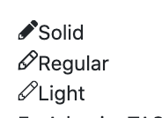

# Widget

## Icon Kullanımı

>Comerın kendi icon yapısının olmasının temel sebebi site performansı, kod okunabilirliğidir

Basit bir şekilde icon kullanımı şu şekildedir


>use common\components\widgets\IconSolid;  //import işlemi

```php
IconSolid::widget(['name' => 'pencil'])
```

Iconun name alanı fontawesome isimleriyle aynıdır.

>  
>Aynı zamanda fotawesome'de ki **solid regular** ve **light** kavramları burada da geçerlidir.

## Icon'a Attribute Eklemek

Icona eklenecek olan attribute'ler `'options'=>[]` altında gösterilir.
```php
IconSolid::widget(['name' => 'redo-alt', 'options' => ['class' => 'fas fa-redo-alt']])
```


